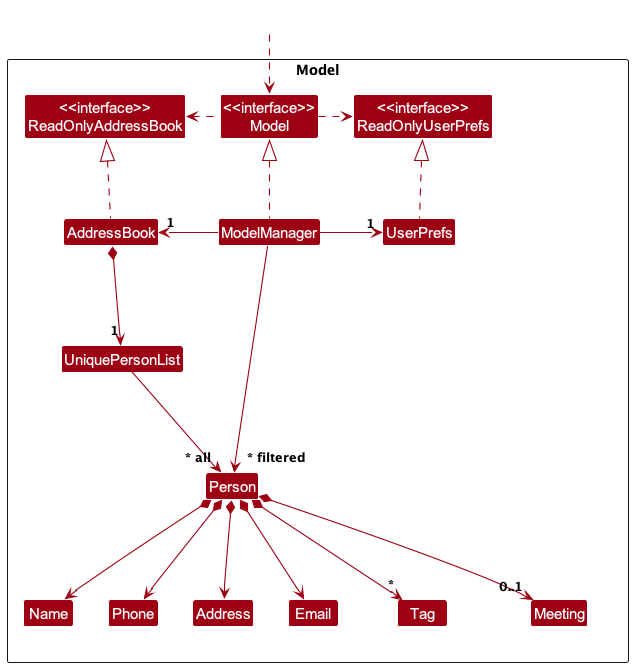
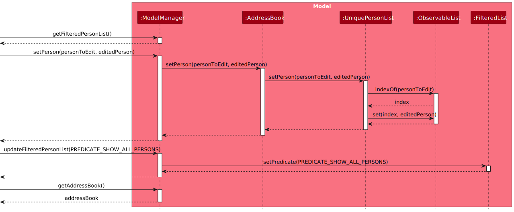
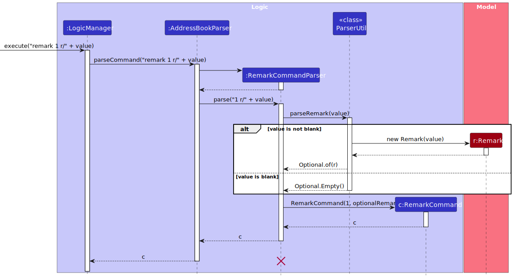
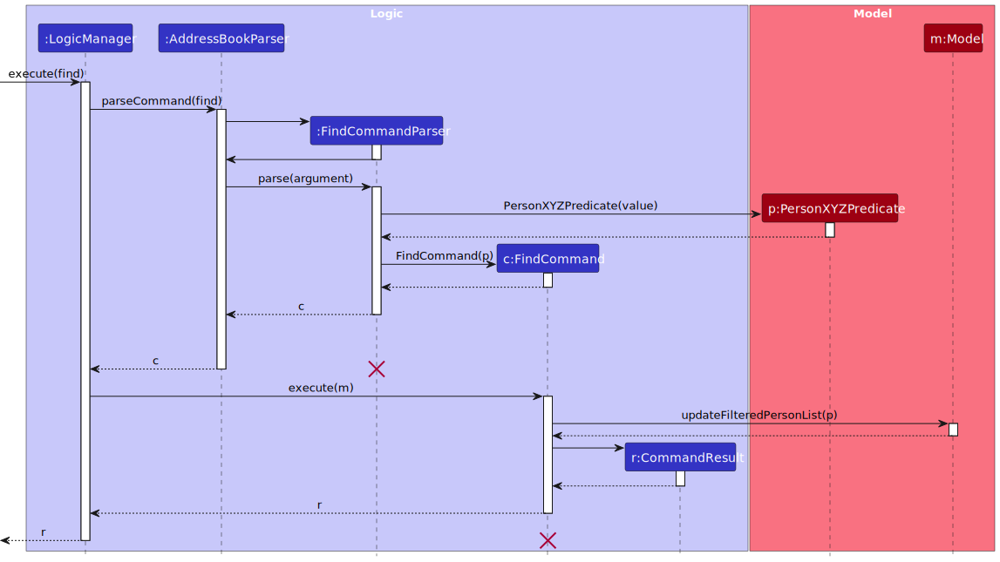

* Table of Contents
{:toc}

--------------------------------------------------------------------------------------------------------------------

## **Acknowledgements**

* {list here sources of all reused/adapted ideas, code, documentation, and third-party libraries -- include links to the original source as well}

--------------------------------------------------------------------------------------------------------------------

## **Setting up, getting started**

Refer to the guide [_Setting up and getting started_](SettingUp.md).

--------------------------------------------------------------------------------------------------------------------

## **Design**

:bulb: **Tip:** The `.puml` files used to create diagrams in this document `docs/diagrams` folder. Refer to the [_PlantUML Tutorial_ at se-edu/guides](https://se-education.org/guides/tutorials/plantUml.html) to learn how to create and edit diagrams.

:information_source: **Note:** For all sequence diagrams, note that the lifeline for objects should end at the destroy marker (X) but due to a limitation of PlantUML, the lifeline continues till the end of diagram.

### Architecture

The ***Architecture Diagram*** given above explains the high-level design of the App.

Given below is a quick overview of main components and how they interact with each other.

**Main components of the architecture**

**`Main`** (consisting of classes [`Main`](https://github.com/se-edu/addressbook-level3/tree/master/src/main/java/seedu/address/Main.java) and [`MainApp`](https://github.com/se-edu/addressbook-level3/tree/master/src/main/java/seedu/address/MainApp.java)) is in charge of the app launch and shut down.
* At app launch, it initializes the other components in the correct sequence, and connects them up with each other.
* At shut down, it shuts down the other components and invokes cleanup methods where necessary.

The bulk of the app's work is done by the following four components:

* [**`UI`**](#ui-component): The UI of the App.
* [**`Logic`**](#logic-component): The command executor.
* [**`Model`**](#model-component): Holds the data of the App in memory.
* [**`Storage`**](#storage-component): Reads data from, and writes data to, the hard disk.

[**`Commons`**](#common-classes) represents a collection of classes used by multiple other components.

**How the architecture components interact with each other**

The *Sequence Diagram* below shows how the components interact with each other for the scenario where the user issues the command `delete 1`.

Each of the four main components (also shown in the diagram above),

* defines its *API* in an `interface` with the same name as the Component.
* implements its functionality using a concrete `{Component Name}Manager` class which follows the corresponding API `interface` mentioned in the previous point.

For example, the `Logic` component defines its API in the `Logic.java` interface and implements its functionality using the `LogicManager.java` class which follows the `Logic` interface. Other components interact with a given component through its interface rather than the concrete class (reason: to prevent outside component's being coupled to the implementation of a component), as illustrated in the (partial) class diagram below.

The sections below give more details of each component.

### UI component

The **API** of this component is specified in [`Ui.java`](https://github.com/se-edu/addressbook-level3/tree/master/src/main/java/seedu/address/ui/Ui.java)

The UI consists of a `MainWindow` that is made up of parts e.g.`CommandBox`, `ResultDisplay`, `PersonListPanel`, `MeetingListPanel`, `StatusBarFooter` etc. All these, including the `MainWindow`, inherit from the abstract `UiPart` class which captures the commonalities between classes that represent parts of the visible GUI.

The `UI` component uses the JavaFx UI framework. The layout of these UI parts are defined in matching `.fxml` files that are in the `src/main/resources/view` folder. For example, the layout of the [`MainWindow`](https://github.com/se-edu/addressbook-level3/tree/master/src/main/java/seedu/address/ui/MainWindow.java) is specified in [`MainWindow.fxml`](https://github.com/se-edu/addressbook-level3/tree/master/src/main/resources/view/MainWindow.fxml)

The `UI` component,

* executes user commands using the `Logic` component.
* listens for changes to `Model` data so that the UI can be updated with the modified data.
* keeps a reference to the `Logic` component, because the `UI` relies on the `Logic` to execute commands.
* depends on some classes in the `Model` component, as it displays `Person` object residing in the `Model`.

### Logic component

**API** : [`Logic.java`](https://github.com/se-edu/addressbook-level3/tree/master/src/main/java/seedu/address/logic/Logic.java)

Here's a (partial) class diagram of the `Logic` component:

The sequence diagram below illustrates the interactions within the `Logic` component, taking `execute("delete 1")` API call as an example.

How the `Logic` component works:

1. When `Logic` is called upon to execute a command, it is passed to an `AddressBookParser` object which in turn creates a parser that matches the command (e.g., `DeleteCommandParser`) and uses it to parse the command.
1. This results in a `Command` object (more precisely, an object of one of its subclasses e.g., `DeleteCommand`) which is executed by the `LogicManager`.
1. The command can communicate with the `Model` when it is executed (e.g. to delete a person). 
   Note that although this is shown as a single step in the diagram above (for simplicity), in the code it can take several interactions (between the command object and the `Model`) to achieve.
1. The result of the command execution is encapsulated as a `CommandResult` object which is returned back from `Logic`.

Here are the other classes in `Logic` (omitted from the class diagram above) that are used for parsing a user command:

How the parsing works:
* When called upon to parse a user command, the `AddressBookParser` class creates an `XYZCommandParser` (`XYZ` is a placeholder for the specific command name e.g., `AddCommandParser`) which uses the other classes shown above to parse the user command and create a `XYZCommand` object (e.g., `AddCommand`) which the `AddressBookParser` returns back as a `Command` object.
* All `XYZCommandParser` classes (e.g., `AddCommandParser`, `DeleteCommandParser`, ...) inherit from the `Parser` interface so that they can be treated similarly where possible e.g, during testing.

### Model component
**API** : [`Model.java`](https://github.com/se-edu/addressbook-level3/tree/master/src/main/java/seedu/address/model/Model.java)

The `Model` component,

* stores the address book data i.e., all `Person` objects (which are contained in a `UniquePersonList` object).
* stores the currently 'selected' `Person` objects (e.g., results of a search query) as a separate _filtered_ list which is exposed to outsiders as an unmodifiable `ObservableList<Person>` that can be 'observed' e.g. the UI can be bound to this list so that the UI automatically updates when the data in the list change.
* stores a `UserPref` object that represents the user’s preferences. This is exposed to the outside as a `ReadOnlyUserPref` objects.
* does not depend on any of the other three components (as the `Model` represents data entities of the domain, they should make sense on their own without depending on other components)

### Storage component

**API** : [`Storage.java`](https://github.com/se-edu/addressbook-level3/tree/master/src/main/java/seedu/address/storage/Storage.java)

The `Storage` component,
* can save both address book data and user preference data in JSON format, and read them back into corresponding objects.
* inherits from both `AddressBookStorage` and `UserPrefStorage`, which means it can be treated as either one (if only the functionality of only one is needed).
* depends on some classes in the `Model` component (because the `Storage` component's job is to save/retrieve objects that belong to the `Model`)

### Common classes

Classes used by multiple components are in the `seedu.findvisor.commons` package.

--------------------------------------------------------------------------------------------------------------------

## **Implementation**

This section describes some noteworthy details on how certain features are implemented.

### Data Changing Commands

The section aims to show how the different components interact with each other when a **command that changes the data** stored in FINDvisor is called.

The `edit` command will be used as an example to demonstrate the interactions.

The following sequence diagram shows the interaction within `Logic` component when executing `EditCommand`.

The following sequence diagram shows the interactions within `Model` component when executing `EditCommand`.

The following sequence diagram shows the interactions within the `Storage` component when executing `EditCommand`.

### Meeting Scheduling

`Person` class has an `Optional<Meeting>` field which will hold a `Meeting` object that contains the meeting details if a meeting is scheduled with the person. Otherwise, it will hold an `Optional.empty()` to represent no meeting is scheduled with the person.

The supported meeting details are:
- Start date time
- End date time
- Remarks

#### Schedule Command

The `schedule` command is implemented to allow users to schedule meetings within the application. The command follows a sequence of interactions similar to the other commands. The part to highlight is `ScheduleCommandParser#parse(String)`  creates a `Meeting` object containing the parsed meeting details and it is then passed to `ScheduleCommand`.

The following sequence diagram shows how a schedule meeting operation goes through the `Logic` component:

#### Reschedule Command

The `reschedule` command is designed to provide users with the capability to update the meeting details of a previously scheduled meeting. The primary action is the creation of a new `Meeting` object with the specified changes, that will replace the current `Meeting` object of the specified person in the Model.

The execution flow of the `reschedule` command follows a sequence of interactions similar to the `edit` Command, with the main difference being `RescheduleCommand` takes a `EditMeetingDescriptor` instead of `EditPersonDescriptor`.

#### Unschedule Command
The `unschedule` command is designed to provide users with the capability to remove previously scheduled meetings. The primary action is the removal of the Meeting object from the specified person's record in the Model.

The execution flow of the `unschedule` command is similar to the one shown for `schedule` command (refer to the sequence diagram for `ScheduleCommand` shown above), with the main difference being the `personToEdit` will have their meeting field set to `Optional.empty()`.

#### Design Choice
The implementation of the `schedule` and `unschedule` command are in this manner to maintain consistency with the existing command structure.

For the schedule command, in the case where a person already has a meeting scheduled, the schedule command will result in an error, instead of overwriting the existing meeting details. This behavior is chosen over the alternative of overwriting the existing meeting details to guard against accidental data loss.

### Remark Feature

Users are able to add a `Remark` to a `Person` in FINDvisor to note down some information about a `Person`.

The remark feature is implemented through creating a `RemarkCommand`, which updates the `Remark` of a `Person`.
A separate command is used to support the remark feature to separate the logic of the personal particulars of a `Person` from the `Remark`.

`Remark` is implemented with the use of the `Optional` generic class (i.e. `Optional<Remark>`) as it is an optional attribute of a `Person`.
While it is possible to determine an empty `Remark` through its value, the `Optional` generic class provides a better abstraction for when a `Remark` is empty.

When a user passes a parameter that is either empty or consists exclusively of whitespace, the `Remark` attribute of a `Person` would be updated to `Optional.empty()`.
This is equivalent to a user removing the previous `Remark` of a `Person`.

The following sequence diagram shows how the remark value is parsed through the `Logic` component:

:information_source: **Note:** The activation bar for `LogicManager` does not end after the `RemarkCommand` is returned. The above diagram is only meant to highlight the parsing for `Remark` which is why the sequence diagram ends here.

### Searching persons by person's information feature
This feature allows users to find for a specific `Person` field based on the user-supplied string, all `Person` that contains the specified search string in the specified field will be displayed to the user. The find mechanism is facilitated by `FindCommand` and `FindCommandParser` that extends `Command` and `Parser` respectively. Note that `FindCommandParser` implements `FindCommand#parse(String)` which checks if there is only one parameter supplied by the user which corresponds to the `Person` field to be searched.

The current supported `Person` fields that can be searched are:
- Name
- Email
- Phone Number
- Address
- Remark
- Meeting Date
- Meeting Remark
- Tags

The following sequence diagram below shows how `Model` and `LogicManger` components interact with the find feature. Below are the definitions used in the sequence diagram:
- `find`: `find n/John`
- `argument`: `n/John`
- `value`: `John`

1. The user executes `find n/John` to find all `Person` with `Name` containing `John`.
2. The `FindCommandParser` checks that only one parameter is present in the user input. This parameter is used to indicate which `Person` field to search for.
3. When called upon to parse the value of the parameter specified by the user, the `FindCommandParser` creates an `PersonXYZPredicate` that encapsulates the user search string e.g. `John` (`XYZ` is a placeholder for the specific `Person` field e.g. `PersonNamePredicate`).
4. All `PersonXYZPredicate` classes (e.g.`PersonNamePredicate`, `PersonEmailPredicate`) inherit from `PersonPredicate` interface so that they can be treated similarly where possible e.g, during testing.
5. A new `FindCommand` instance is created by `FindCommandParser` and is executed by `LogicManger`.
6. `FindCommand` will call `Model#updateFilteredPersonList(PersonPredicate)` to update the `UI` and display all `Person` that has `Name` containing `John`.
7. The result of the command execution is encapsulated as a `CommandResult` object which is returned back to `LogicManager`.

#### Search persons by person's meeting date sub-feature
For search queries based on person's meeting date, the user input will be first validated in `FindCommandParser` to check if it matches the date format specified in FINDvisor. This validation is facilitated by `ParserUtil#parseMeetingDate(String)`. Afterwards, `FindCommandParser` will create a new `PersonMeetingDatePredicate(LocalDate)` with the parsed user input if it is valid. 

The following sequence diagram below show `Model` and `LogicManger` components interact with the find by person's meeting date sub-feature. Below are the definitions used in the sequence diagram:
- `find`: `find m/25-04-2024`
- `argument`: `m/25-04-2024`
- `value`: `25-04-2024`

### Add Tag Feature
This feature allows users to add `tags` to a `person` within the contact list, without the need to use the `edit` command.

This feature is implemented through the `AddTagCommand` and the `AddTagCommandParser` which extends `Command` and `Parser` respectively.

The `AddTagCommandParser` takes in an `index` and the `tags` to add to a person. If both are supplied and valid, they are passed into the `AddTagCommand`, if not it will throw an exception according to the error.

The following sequence diagram shows how `AddTag` interacts with `Logic`.

1. The user keys in `addtags 1 t/validTag1 t/validTag2` to add 2 valid tags to the `person` at the first `index`.
2. The `AddTagCommandParser` validates `index` and `tags`, then returns a new `AddTagCommand` with the corresponding index and set of tags.
3. The `LogicManager` then executes the `AddTagCommand`.
4. The `AddTagCommand` finds the `Person` to add tags to using `Index` and creates a new `Person` with the added tags.
5. `AddTagCommand` then calls the `setPerson(person, personWithAddedTags)` method to set the old `Person` to the newly created `Person`.
6. `AddTagCommand` then calls `updateFilteredPersonList(PREDICATE_SHOW_ALL_PERSONS)` to update `UI` to display the person with the newly added `Tags`.
7. `CommandResult` is then returned to `LogicManager`.

### Delete Tag Feature

This section aims to show the logic behind delete tag command and the consideration behind the scene.

Delete Tag Command is a new featured added for user to delete one specific tag associated with a specific person located by index of the current list. This command is called by `deletetag` followed by the index of the targeted person, then by one target tag `tag` object. In case of the targeting tag is not associated with the person, an error message suggesting missing targeted tag will be returned.

The delete tag mechanism is facilitated by `DeleteTagCommand` and `DeleteTagCommandParser` that extends `Command` and `Parser` respectively. The `DeleteTagCommandParser` takes in an `index` and the `tag` to delete from a person. If both are supplied and valid, they are passed into the `DeleteTagCommand`.

The following sequence diagram shows how `DeleteTagCommand` interacts with `Logic`.

1. The user keys in `deletetag 1 t/validTag` to delete `validTag` associated with the `person` at the first `index`.
2. The `DeleteTagCommandParser` checks that the `index` and `tag` are valid, then returns a new `DeleteTagCommand` with the corresponding index and the target tag.
3. The `LogicManager` then executes the `DeleteTagCommand`.
4. The `DeleteTagCommand` finds the `Person` using `Index` and check whether the target tag exists for the `Person`.
5. If targeted `tag` is found with the targeted `Person`, then the command creates a new `Person` with the all other tags except the targeted tag.
6. If targeted `tag` is not found with the targeted `Person`, then the command will return an error message indicating the `Person` does not have the targeted `validTag`.
7. `DeleteTagCommand` then calls the `setPerson(person, editedPerson)` method to set the old `Person` to the newly created `Person`.
8. `DeleteTagCommand` then calls `updateFilteredPersonList(PREDICATE_SHOW_ALL_PERSONS)` to update `UI` to display the newly updated person list in Findvisor.
9. `CommandResult` is then returned to `LogicManager`.

### \[Proposed\] Undo/redo feature

#### Proposed Implementation

The proposed undo/redo mechanism is facilitated by `VersionedAddressBook`. It extends `AddressBook` with an undo/redo history, stored internally as an `addressBookStateList` and `currentStatePointer`. Additionally, it implements the following operations:

* `VersionedAddressBook#commit()` — Saves the current address book state in its history.
* `VersionedAddressBook#undo()` — Restores the previous address book state from its history.
* `VersionedAddressBook#redo()` — Restores a previously undone address book state from its history.

These operations are exposed in the `Model` interface as `Model#commitAddressBook()`, `Model#undoAddressBook()` and `Model#redoAddressBook()` respectively.

Given below is an example usage scenario and how the undo/redo mechanism behaves at each step.

Step 1. The user launches the application for the first time. The `VersionedAddressBook` will be initialized with the initial address book state, and the `currentStatePointer` pointing to that single address book state.

Step 2. The user executes `delete 5` command to delete the 5th person in the address book. The `delete` command calls `Model#commitAddressBook()`, causing the modified state of the address book after the `delete 5` command executes to be saved in the `addressBookStateList`, and the `currentStatePointer` is shifted to the newly inserted address book state.

Step 3. The user executes `add n/David …​` to add a new person. The `add` command also calls `Model#commitAddressBook()`, causing another modified address book state to be saved into the `addressBookStateList`.

:information_source: **Note:** If a command fails its execution, it will not call `Model#commitAddressBook()`, so the address book state will not be saved into the `addressBookStateList`.

Step 4. The user now decides that adding the person was a mistake, and decides to undo that action by executing the `undo` command. The `undo` command will call `Model#undoAddressBook()`, which will shift the `currentStatePointer` once to the left, pointing it to the previous address book state, and restores the address book to that state.

:information_source: **Note:** If the `currentStatePointer` is at index 0, pointing to the initial AddressBook state, then there are no previous AddressBook states to restore. The `undo` command uses `Model#canUndoAddressBook()` to check if this is the case. If so, it will return an error to the user rather
than attempting to perform the undo.

The following sequence diagram shows how an undo operation goes through the `Logic` component:

Similarly, how an undo operation goes through the `Model` component is shown below:

The `redo` command does the opposite — it calls `Model#redoAddressBook()`, which shifts the `currentStatePointer` once to the right, pointing to the previously undone state, and restores the address book to that state.

:information_source: **Note:** If the `currentStatePointer` is at index `addressBookStateList.size() - 1`, pointing to the latest address book state, then there are no undone AddressBook states to restore. The `redo` command uses `Model#canRedoAddressBook()` to check if this is the case. If so, it will return an error to the user rather than attempting to perform the redo.

Step 5. The user then decides to execute the command `list`. Commands that do not modify the address book, such as `list`, will usually not call `Model#commitAddressBook()`, `Model#undoAddressBook()` or `Model#redoAddressBook()`. Thus, the `addressBookStateList` remains unchanged.

Step 6. The user executes `clear`, which calls `Model#commitAddressBook()`. Since the `currentStatePointer` is not pointing at the end of the `addressBookStateList`, all address book states after the `currentStatePointer` will be purged. Reason: It no longer makes sense to redo the `add n/David …​` command. This is the behavior that most modern desktop applications follow.

The following activity diagram summarizes what happens when a user executes a new command:

#### Design considerations:

**Aspect: How undo & redo executes:**

* **Alternative 1 (current choice):** Saves the entire address book.
  * Pros: Easy to implement.
  * Cons: May have performance issues in terms of memory usage.

* **Alternative 2:** Individual command knows how to undo/redo by
  itself.
  * Pros: Will use less memory (e.g. for `delete`, just save the person being deleted).
  * Cons: We must ensure that the implementation of each individual command are correct.

_{more aspects and alternatives to be added}_

--------------------------------------------------------------------------------------------------------------------

## **Planned Enhancements**

**Team size: 5**

### 1. Allow users to enter more special characters for Remark and Meeting Remark fields
**Current Implementation**: 

- `REMARK` and `MEETING_REMARK` fields uses **the same pre-defined set of allowed characters** to prevent issues with command parsing. User inputs that contains any characters **not included** in the pre-defined set will be treated as invalid and results with an error message.
- For example, if the user wishes to add a remark titled "Birthday on 23/02/2024" for an existing Person at index 1, the command `remark 1 r/Birthday on 23/02/2024` will be invalid.

**Proposed Enhancement**: 

- Modify the pre-defined set of allowed characters to **capture any character instead**. However, the characters `\` and `/` **must** be escaped with `\` in order for them to be recognized as an input to the field as these characters may hinder some operations of FINDvior.
- With reference to the previous `remark` command, the remark will be successfully saved when the user enters `remark 1 r/Birthday on 23\/02\/2024`.
- These changes allow for flexibility since all special characters will be accepted for the `REMARK` field.

### 2. Allow users to enter more special characters for Address field
**Current Implementation**: 

- Similar to Planned Enhancement 1, the `ADDRESS` field uses a **pre-defined set of allowed characters** to prevent issues with command parsing. User inputs that contains any characters **not included** in the pre-defined set will be treated as invalid and results with an error message.
- For example, if the user wishes to edit an existing Person's address at index 1 with the value "Pinnacle@Duxton", the command `edit 1 a/Pinnacle@Duxton` will be invalid.

**Proposed Enhancement**: 

- Modify the pre-defined set of allowed characters to **capture any character instead**. However, the characters `\` and `/` **must** be escaped with `\` in order for them to be recognized as an input to the field as these characters may hinder some operations of FINDvior.
- For addresses containing `/` characters, the user **must** use the `\` character to escape each `/` character similar to the example in Planned Enhancement 1.
- These changes allow for flexibility since all special characters will be accepted for the `ADDRESS` field.

### 3. Allow users to enter more special characters for Name field
**Current Implementation**:

- The `NAME` field uses a **pre-defined set of allowed characters** to prevent issues with command parsing. User inputs that contains any characters **not included** in the pre-defined set will be treated as invalid and results with an error message.
- For example, if the user wishes to edit a contact's name to "Samintharaj Kumar s/o A. Nair" for an existing Person at index 1, the command `edit 1 n/Samintharaj Kumar s/o A. Nair` will be invalid as `/` and `.` are not allowed.

**Proposed Enhancement**:

- Modify the pre-defined set of allowed characters to **capture any character instead**. However, the characters `\` and `/` **must** be escaped with `\` in order for them to be recognized as an input to the field as these characters may hinder some operations of FINDvior.
- With reference to the previous `edit` command, the person at index 1 will have their name successfully edited when the user enters `edit 1 n/Samintharaj Kumar s\/o A. Nair`.
- These changes allow for flexibility since all special characters will be accepted for the `NAME` field.

### 4. Increase flexibility of Date and DateTime formats

**Current Implementation**:

- FINDvisor only strictly accepts `DATE` of the format `dd-MM-yyyy` and `DATETIME` of the format `dd-MM-yyyy`T`HH:mm`.
- This requires single digit day and month values to be padded with a zero to be accepted by FINDvisor, hindering the ease of use of the function.
- For example, if the user wishes to schedule a meeting to a `START_DATETIME` of `1/1/2024T9:30`, which is equivalent to a valid datetime `01/01/2024T09:30`, FINDvisor will recognize the `START_DATETIME` value as invalid as it does not comply to our specified format.

**Proposed Implementation**:

- Modify the format of `DATE` to be `d-M-yyyy` and `DATETIME` to be `d-M-yyyy`T`H:mm` instead.
- This allows FINDvisor to accept both single and double-digits day, month and hour values as valid `DATE` and `DATETIME` values and would not require users to pad these single digit values with a leading zero.

### 5. Show warning to user when scheduling an overlapping meeting
**Current Implementation**:

- No checks for conflicting meetings are done when scheduling a new meeting. The user is able to schedule a meeting with multiple people that can overlap with each other with no warnings.

**Proposed Enhancement**:

- When a new meeting is being scheduled or a previous meeting is being rescheduled, the input meeting date and times will be checked against all existing meetings, if there is an overlap, a warning message will be shown to the user.
- This can be achieved by iterating through all existing persons, and if the person have a non-empty meeting field, check if the new meeting date times overlaps with the existing meeting date times.
- Two meetings **overlap** when the start time of the one meeting is strictly between the start and end date time of another meeting, or when the end time of the one meeting is strictly between the start and end date time of another meeting.

--------------------------------------------------------------------------------------------------------------------

## **Documentation, logging, testing, configuration, dev-ops**

* [Documentation guide](Documentation.md)
* [Testing guide](Testing.md)
* [Logging guide](Logging.md)
* [Configuration guide](Configuration.md)
* [DevOps guide](DevOps.md)

--------------------------------------------------------------------------------------------------------------------

## **Appendix: Requirements**

### Product scope

**Target user profile**:

* financial advisors based in Singapore and deals with Singaporean clients
* has a need of scheduling meetings with a significant number of clients
* can type fast
* prefers typing to mouse interactions
* is reasonably comfortable using CLI apps
* has English as his first language

**Value proposition**: FINDvisor aims to streamline client management for financial advisors with a tool that organizes contact information. Furthermore, it aims to simplify organising meetings, and tracks client goals for better timeline planning—all in one clutter-free interface.

### User stories

Priorities: High (must have) - `* * *`, Medium (nice to have) - `* *`, Low (unlikely to have) - `*`

| Priority | As a …​           | I want to …​                                                                             | So that I can…​                                                               |
|----------|-------------------|------------------------------------------------------------------------------------------|-------------------------------------------------------------------------------|
| `* * *`  | New user          | easily download and launch FINDvisor                                                     | quickly start managing my client information                                  |
| `* * *`  | New user          | know how to operate the basic functionalities of FINDvisor                               |                                                                               |
| `* * *`  | New user          | know how to operate the basic functionalities of FINDvisor within the app                | learn how to use FINDvisor without heavily referencing external documentation |
| `* * *`  | Financial Advisor | add contacts of my clients                                                               | keep a record of my clients' contact information                              |
| `* * *`  | Financial Advisor | delete a client's contact                                                                | reduce clutter in contact list with clients I no longer need contact with     |
| `* * *`  | Financial Advisor | update client's contact information                                                      |                                                                               |
| `* * *`  | Financial Advisor | find a client's contact based on what I remember about the client's contact information  | do not have to search through the whole list to find a specific client        |
| `* * *`  | Financial Advisor | filter contact list by categories                                                        | easily find clients based on category                                         |
| `* * *`  | Financial Advisor | attach a meeting date and time to my client contact                                      | know the next meeting plan with a specific client                             |
| `* * *`  | Financial Advisor | delete a scheduled meeting                                                               | update my schedule in the event of a cancelled meeting                        |
| `* * *`  | Financial Advisor | categorize my clients into different categories such as financial plans or relationships |                                                                               |
| `* *`    | Financial Advisor | view all my meetings for today                                                           | be prepared for my meetings of today                                          |
| `* *`    | Financial Advisor | filter contact list by meeting date                                                      | find out who I'm meeting on a specific date                                   |
| `* *`    | Financial Advisor | modify a scheduled meeting's date and time                                               | update a meeting's schedule accordingly                                       |
| `* *`    | Financial Advisor | re-categorize my clients into different categories                                       | reorganize my client's categories when needed                                 |
| `*`      | New user          | import contact information in bulk to FINDvisor                                          | easily transfer all my client's contact into FINDvisor                        |
| `* *`    | Financial Advisor | add a remark about a client                                                              | take note of additional information about a client as required                |
| `*`      | Financial Advisor | add a note about each meeting                                                            | know what the meeting is about                                                |
| `*`      | Financial Advisor | edit a note about each meeting                                                           | update what the meeting is about                                              |
| `*`      | Financial Advisor | schedule recurring meeting plans                                                         | save the effort manually scheduling the meeting each time                     |
| `*`      | Experienced User  | remove past meeting information that is no longer needed in bulk                         | easily keep my contact list and meeting information up to date.               |
| `*`      | Experienced User  | use shorthand commands                                                                   | speed up my workflow                                                          |
| `*`      | Experienced User  | set up shortcuts that I can run                                                          | speed up my workflow                                                          |
| `*`      | Experienced User  | export my data                                                                           | backup my data                                                                |
| `*`      | Experienced User  | import my data                                                                           | restore my data from backup                                                   |
| `*`      | Experienced User  | archive contact data that are not in use, but I still want to keep                       | reduce clutter in the application                                             |
| `*`      | Experienced User  | archive past meeting data that are not in use, but I still want to keep                  | reduce clutter in the application                                             |

### Use cases

(For all use cases below, the **System** is the `FINDvisor` and the **Actor** is the `user`, unless specified otherwise)

#### Use case: Edit a person

**MSS**

1. User requests to list persons.
2. FINDvisor shows a list of persons.
3. User requests to edit a specific field(s) of a specified person in the list.
4. FINDvisor edits respective fields of the person.

    Use case ends.

**Extensions**

* 2a. The list is empty.

    Use case ends.

* 3a. FINDvisor detects an error in the given data for editing a person.
    * 3a1. FINDvisor shows an error message.

      Use case resumes from step 3.

#### Use case: Search for specific persons based on a person's field

**MSS**

1. User requests to find persons based on the entered the search category and keywords.
2. FINDvisor displays all persons that contains specified keywords for the specified search category.

    Use case ends.

**Extensions**

* 1a. No persons match the specified keywords.
  * 1a1. FINDvisor displays an empty list.

    Use case ends.

* 1b. FINDvisor detects an error in specified keywords.
  * 1b1. FINDvisor shows an error message and requests for valid keywords from the user.

    Use case resumes at step 1.

* 1c. The given category is invalid.
  * 1c1. FINDvisor shows an error message and requests for a valid category from the user.

    Use case resumes at step 1.

#### Use case: Delete a person

**MSS**

1.  User requests to list persons.
2.  FINDvisor shows a list of persons.
3.  User requests to delete a specific person in the list.
4.  FINDvisor deletes the person.

    Use case ends.

**Extensions**

* 2a. The list is empty.

  Use case ends.

* 3a. FINDvisor detects an error in the given data for deleting a person.
    * 3a1. FINDvisor shows an error message.

      Use case resumes from step 3.

#### Use Case: Scheduling a meeting with a new person

**MSS**

1. User adds new person to FINDvisor.
2. User requests to list persons.
3. FINDvisor shows a list of persons.
4. User requests to schedule a meeting with a specific person in the list.
5. Meeting is scheduled.

    Use case ends.

**Extensions**

* 3a. FINDvisor detects an error in the given data for adding a person.
    * 3a1. FINDvisor shows an error message.

      Use case resumes from step 1.

* 4a. FINDvisor detects an error in the given data for scheduling a meeting.
    * 4a1. FINDvisor shows an error message.

      Use case resumes from step 4.

#### Use case: Update the remark of a person

**MSS**

1. User requests to list persons.
2. FINDvisor shows a list of persons.
3. User requests to update the remark of a specific person in the list.
4. FINDvisor updates the remark of the person.

   Use case ends.

**Extensions**

* 2a. The list is empty.

  Use case ends.

* 3a. FINDvisor detects an error in the given data for updating a remark.
    * 3a1. FINDvisor shows an error message.

      Use case resumes from step 3.

* 3b. User requests to remove the remark.
    * 3b1. FINDvisor removes the remark of the person.

      Use case ends.

#### Use case: Add tags to a person

**MSS**

1. User requests to list persons.
2. FINDvisor shows a list of persons.
3. User requests to add tags to a specific person in the list.
4. FINDvisor adds specified tags to the person.

   Use case ends.

**Extensions**

* 2a. The list is empty.

  Use case ends.

* 3a. The given index is invalid.
    * 3a1. FINDvisor shows an error message.

      Use case resumes at step 2.

* 3b. No tag is given.
    * 3b1. FINDvisor shows an error message.

      Use case resumes at step 2.

* 3c. Fields do not comply with stated formats and constraints.
    * 3c1. FINDvisor shows an error message.

      Use case resumes at step 2.

#### Use case: Deleting tags from a person

**MSS**

1.  User requests to list persons.
2.  FINDvisor shows a list of persons.
3.  User requests to delete one or more tags associated with a specific person in the list.
4.  FINDvisor deletes the tags associated with the specific person.

    Use case ends.

**Extensions**

* 2a. The list is empty.

  Use case ends.

* 3a. FINDvisor detects an error in the given data for deleting a tag.

    * 3a1. FINDvisor shows an error message.

      Use case resumes from step 2.

* 4a. FINDvisor detects an error in the given data for deleting a tag.

    * 4a1. FINDvisor shows an error message.

      Use case ends.

### Non-Functional Requirements

1.  Should work on any _mainstream OS_ as long as it has Java `11` or above installed.
2.  Should work without requiring an installer.
3.  Should be packaged into a single jar file.
4.  Should be below the size limit of 100MB for FINDvisor and 15MB for Docs.
5.  Should be able to hold up to 1000 persons without a noticeable sluggishness in performance for typical usage.
6.  Should not depend on a remote server.
7.  A user with above average typing speed for regular English text (i.e. not code, not system admin commands) should be able to accomplish most of the tasks faster using commands than using the mouse.
8.  Should not cause any resolution-related inconveniences to user.
9.  Should store data locally in a human editable text file without the use of DBMS.
10. Should be used by a single user.
11. Command names should be representative of their actions.

### Glossary

* **Mainstream OS**: Windows, Linux, Unix, MacOS.
* **Private contact detail**: A contact detail that is not meant to be shared with others.

--------------------------------------------------------------------------------------------------------------------

## **Appendix: Instructions for manual testing**

Given below are instructions to test the app manually.

:information_source: **Note:** These instructions only provide a starting point for testers to work on;
testers are expected to do more *exploratory* testing. Hence, the list of alternative test cases are **not exhaustive**.

### Launch and shutdown

#### Initial launch

**Prerequisites:**
1. `Java 11` is installed in the system.

**Steps:**
1. Download the latest `findvisor.jar` file and move it into an empty folder.
2. Open the command terminal at the folder containing `findvisor.jar`.
3. Run `java -jar FINDvisor.jar`.

**Expected Result:**
1. FINDvisor GUI appears in a minimized window.
2. FINDvisor contains a list of sample contacts.

#### Saving workspace settings

**Steps:**
1. Test case: Resize the window to a preferred size.
2. Close FINDvisor.
3. Relaunch FINDvisor through the command terminal as stated in [initial launch](#initial-launch).

**Expected Result:**
1. FINDvisor retains the previous window state before it was closed.

**Alternative Test Cases:**
- Shifting the window to a desired position.
- Maximizing the window and restoring the window from maximized state.
- Changing the divider position between *Today's Meeting Panel* and other UI components.

Alternative test cases should have similar expected results.

### Adding a person

#### Adding a person successfully

**Prerequisites:**
1. There is no person in the list with the same mobile phone number as the person to be added.

**Steps:**
1. Test case: `add n/Brendan Lim e/brendanl@gmail.com p/96734294 a/Blk 653C Jurong West Street 61 Singapore 643653`.

**Expected Result:**
1. *Person List* shows all contacts in FINDvisor.
2. *Person List* contains the information of the newly added person as specified.
3. *Command Result Box* outputs a successful execution message with the newly added person's information.
4. *Command Box* is cleared.

**Alternative Test Cases:**
- `add n/Brendan Lim e/brendanl@gmail.com p/96734294 a/Blk 653C Jurong West Street 61 Singapore 643653 t/PRUGrowth t/LimFamily` (adding a person with tags).
- `add p/96734294 n/Brendan Lim e/brendanl@gmail.com t/PRUGrowth a/Blk 653C Jurong West Street 61 Singapore 643653 t/LimFamily` (adding a person in any order of prefixes).
- `add n/Brendan Lim the 3rd e/brendanl@gmail.com p/96734294 a/Blk 653C Jurong West Street 61 Singapore 643653` (adding a person with numbers in name).

Alternative test cases should have similar expected results.

#### Invalid value or format used for adding a person

**Prerequisites:**
1. There are multiple persons stored in FINDvisor data.
2. There is no person with the mobile phone number `96734294`.
3. There is a person with the mobile phone number `88812457`.

**Steps:**
1. Test case: `add n/Lim Wei Sheng, Brendan e/brendanl@gmail.com p/96734294 a/Blk 653C Jurong West Street 61 Singapore 643653 t/PRUGrowth` (adding a person with invalid name value).

**Expected Result:**
1. Person is **not** added to FINDvisor.
2. Input in the *Command Box* remains and turns red.
3. Error details are stated in the *Command Result Box*.

**Alternative Test Cases:**
- `add n/Devin Leonardo e/devinleo@gmail.com p/88812457 a/Blk 60 Kaki Bukit Place 03-11 Singapore 415979` (adding a person with duplicate phone number).
- `add n/Brendan Lim e/brendanl@gmail.com p/96734294` (adding a person but missing a required field).
- `add n/ e/brendanl@gmail.com p/96734294 a/Blk 653C Jurong West Street 61 Singapore 643653 t/PRUGrowth` (adding a person with a blank required field).
- `add n/Brendan Lim n/Lim Wei Sheng Brendan e/brendanl@gmail.com p/96734294 a/Blk 653C Jurong West Street 61 Singapore 643653 t/PRUGrowth` (adding a person with two name fields).

Alternative test cases should have similar expected results.

### Deleting a person

1. Deleting a person while all persons are being shown

   1. Prerequisites: List all persons using the `list` command. Multiple persons in the list.

   1. Test case: `delete 1` 
      Expected: First contact is deleted from the list. Details of the deleted contact shown in the status message. Timestamp in the status bar is updated.

   1. Test case: `delete 0` 
      Expected: No person is deleted. Error details shown in the status message. Status bar remains the same.

   1. Other incorrect delete commands to try: `delete`, `delete x`, `...` (where x is larger than the list size) 
      Expected: Similar to previous.

1. _{ more test cases …​ }_

### Deleting a tag

1. Deleting a tag while all persons are being shown

   1. Prerequisites: List all persons using the `list` command. Multiple persons in the list.

   1. Test case: `delete 1 t/validTag` 
      Expected: First contact is selected from the list. Tags of the selected contact will be checked.
      If validTag exisits in the person's tags, it will be removed. Successful output will be showned in the status message.
      If validTag does not exisit in the person's tags, failure output will be showned in the status message.
      Timestamp in the status bar is updated.

   1. Test case: `delete 0 t/validTag` 
      Expected: No tag is deleted as 0 is not a valid index for person. Error details shown in the status message. Status bar remains the same.

   1. Test case: `delete 1 t/invalidTag` 
      Expected: No tag is deleted as the tag is invalid. Error details shown in the status message. Status bar remains the same.

   1. Test case: `delete 1 t/containedTag t/notContainedTag` 
      Expected: No tag is deleted as one of the targeting tags is not associated with the person. Error details shown in the status message. Status bar remains the same.

   1. Other incorrect delete commands to try: `deletetag`, `deletetag x`, `...` (where x is larger than the list size) 
      Expected: Similar to previous.

### Saving data

1. Dealing with missing/corrupted data files

   1. _{explain how to simulate a missing/corrupted file, and the expected behavior}_

1. _{ more test cases …​ }_
