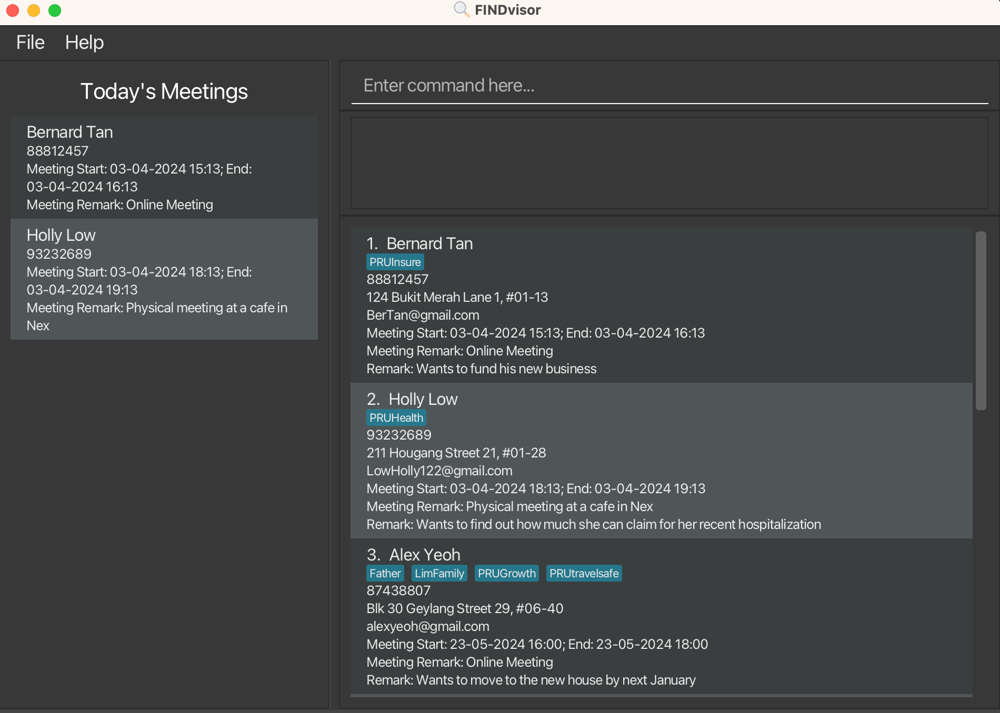

## Table of Contents
{:.no_toc}

* ToC
{:toc}

--------------------------------------------------------------------------------------------------------------------

## About FINDvisor
FINDvisor is a desktop app for **Singapore-based** financial advisors to manage contacts with **Singapore-based mobile phone numbers**. If you **frequently schedule meetings and require quick access to your contacts' details**, then FINDvisor is the tool for you. It is optimized for typists, enabling individuals who type fast to perform contact management and meeting scheduling tasks efficiently.

FINDvisor enables financial advisors to quickly save and retrieve the following contact's information such as name, phone number, email and physical address. It also allows financial advisors to add a remark and tags to specific contacts where needed, while offering the capability to manage their meeting details with their contacts.

## Quick start
1. Ensure you have Java `11` or above installed in your Computer.

1. Download the latest `findvisor.jar` from [here](https://github.com/AY2324S2-CS2103-F15-1/tp/releases).

1. Copy the file to the folder you want to use as the _home folder_ for your FINDvisor.

1. Open a command terminal, `cd` into the folder you put the jar file in, and use the `java -jar findvisor.jar` command to run the application. 
   A GUI similar to the below should appear in a few seconds. Note how the app contains some sample data. 
   

1. Type the command in the command box and press Enter to execute it. e.g. typing **`help`** and pressing Enter will open the help window. 
   Some example commands you can try:

   * `list` : Lists all contacts.

   * `add n/John Doe p/98765432 e/johnd@example.com a/John street, block 123, #01-01` : Adds a contact named `John Doe` to FINDvisor.

   * `delete 3` : Deletes the 3rd contact shown in the current list.

   * `clear` : Deletes all contacts.

   * `exit` : Exits the app.

1. Refer to the [Features](#features) below for details of each command.

--------------------------------------------------------------------------------------------------------------------
## Interacting with FINDvisor
The components of FINDvisor's user interface are shown below: 

1. *Command Box*: Commands are entered in this box and executed when the user presses the Enter key. The command entered will be cleared when a command is executed successfully.
2. *Command Result Box*: The feedback for command will be displayed, indicating if command executed was successful. An error message will be displayed if the command was unsuccessful.
3. *Person List*: The list of persons stored in FINDvisor. Note that this list will display the latest list when a command to update the list is **executed successfully**.
4. *Today's Meeting List*: The list of persons who have a meeting on the current date of your computer when running the application (if any). This list is updated accordingly to match the latest persons' information in *Person List*.

### On Command Success
Below is a sample command that is executed successfully. Note that the feedback is displayed in the **Command Result Box** and the **Person List** displays the newly added person. 

### On Command Failure
Below is a sample unsuccessful command executed. Note that the command is highlighted in red in the **Command Box** and the **Command Result Box** displays the relevant error message. 

## Features

**:information_source: Notes about the command format:** 

* Words in `UPPER_CASE` are the parameters to be supplied by the user. 
  * e.g. in `add n/NAME`, `NAME` is a parameter which can be used as `add n/John Doe`.

* Items in square brackets are optional. 
  * e.g `n/NAME [t/TAG]` can be used as `n/John Doe t/friend` or as `n/John Doe`.

* Items with `…`​ after them can be used one or more times. 
  * e.g. `t/TAG…​` can be used as `t/DoeFamily` or `t/PRUactiveCash t/DoeFamily` etc.

* Items with separated with `|` requires exactly one item to be matched.
  * e.g. `n/NAME|p/PHONE_NUMBER` can only accept `n/John Doe` or `p/91234567` but not both.

* Parameters can be in any order. 
  * e.g. if the command specifies `n/NAME p/PHONE_NUMBER`, `p/PHONE_NUMBER n/NAME` is also acceptable.

* Extraneous parameters for commands that do not take in parameters (such as `help`, `list`, `exit` and `clear`) will be ignored. 
  * e.g. if the command specifies `help 123`, it will be interpreted as `help`.

* If you are using a PDF version of this document, be careful when copying and pasting commands that span multiple lines as space characters surrounding line-breaks may be omitted when copied over to the application.

**:information_source: Notes about input values format:** 

* Input values cannot be blank unless otherwise specified.
* Spacing of values:
  * Leading and trailing spaces of input values will be removed.
  * Extra spaces between values will remain unless otherwise specified.

* Case sensitivity:
  * All input values are case-sensitive unless otherwise specified.

* Duplicate contacts:
  * In FINDvisor, contacts are **uniquely identified** using their mobile phone number. Hence, two contacts are considered duplicates if they share the same mobile phone number.

* `NAME` format:
  * Can only contain alphanumeric characters and spaces.
  * Extra spaces between values will be processed as a single space.

* `PHONE_NUMBER` format:
  * Must follow the standard Singapore mobile phone numbers (i.e. 9XXXXXXX or 8XXXXXXX).
  * Spaces between numbers will be ignored.

* `EMAIL` format:
  * Must follow the standard email address format (i.e. example@example.com).

* `ADDRESS` format:
  * Can only consist of alphanumeric characters, whitespace and the following set of characters: ``#-(),``.

* `TAG` format:
  * Can only consist of alphanumeric characters.

* `DATETIME` format:
  * Applies to all parameters with `DATETIME` postfix (i.e. `START_DATETIME` and `END_DATETIME`).
  * Must follow the format `dd-MM-yyyy`T`HH:mm` (i.e. `23-02-2024T14:00`).

* `DATE` format:
  * Applies to all parameters with `DATE` postfix (i.e.`MEETING_DATE`).
  * Must follow the format `dd-MM-yyyy` (i.e. `23-02-2024`).

* `REMARK` format:
    * Can only consist of alphanumeric characters, whitespace and the following set of characters: ``!@#$%^&*()_+-{}[]:;'\"<>?.,|~`\``.

* `MEETING_REMARK` format:
    * Allowed characters are the same as `REMARK` format.
    * Maximum length of 200 characters.

### Adding a person: `add`

Adds a person to the contact list in FINDvisor.

Format: `add n/NAME p/PHONE_NUMBER e/EMAIL a/ADDRESS [t/TAG]…​`

:bulb: **Tip:**
A person can have any number of tags (including 0).

Examples:
* `add n/Bobby Tay p/9678 5432 e/BobbyTay@gmail.com a/Blk 123 Foo Street 45, #07-89 t/PRUactiveCash`
* `add n/Betsy Crowe t/PRUactiveCash e/betsycrowe@example.com a/Block 82 Marine Parade Central #01-600 p/9876 5432 t/PRUTravellerProtect`

Specifications:
* `p/PHONE_NUMBER` has to be unique from the other contacts in FINDvisor.

### Listing all persons : `list`

Shows a list of all persons in the contact list of FINDvisor.

Format: `list`

### Editing a person : `edit`

Edits an existing person's contact information (name, phone number, email and address) and tags in FINDvisor.

Format: `edit INDEX [n/NAME] [p/PHONE_NUMBER] [e/EMAIL] [a/ADDRESS] [t/TAG]…​`

* Edits the person at the specified `INDEX`.
* The index refers to the index number shown in the current displayed person list.
* The index **must be a positive integer** 1, 2, 3, …​
* At least one of the optional fields must be provided.
* Input values will overwrite **all** existing values that were assigned to the specified field.
* When editing tags, the existing tags of the person will be removed i.e adding of tags is not cumulative.
* You can remove all the person’s tags by typing `t/` without specifying any tags after it.
* This command will check for duplicate mobile phone number before edit is executed. If the new mobile phone number is used by another person, the command will not be executed.

Examples:
* `edit 3 n/Bobby Tay e/bobbytay@u.nus.edu` Edits contact displayed at index 3 and changes the name of the contact to `Bobby Tay` and email to `bobbytay@u.nus.edu` respectively.
* `edit 1 t/PRUActiveSaverIII t/PRUActiveCash` Edits contact displayed at index 1 to change its tags to only `PRUActiveSaverIII` and `PRUActiveCash`. It will remove all other previous tags that are previously associated with the contact.

### Searching persons by person's information: `find`

Finds persons that contains specified keywords based on **a specified category** of a person's information.

Format:`find n/NAME|e/EMAIL|p/PHONE_NUMBER|a/ADDRESS|r/REMARK|m/MEETING_DATE` `|mr/MEETING_REMARK|t/TAG…` 

* **Only one category can be specified** and searched for any instance of the `find` command.
* Specified keywords **must not be blank**.
* User input will be validated **only** for `find m/MEETING_DATE` based on the `DATE` format.
  * For other categories, user input **does not have to conform** to the corresponding parameter format, e.g. `find p/John`, however no persons will be matched.
* The search checks if a person's information **contains** the keyword specified, e.g. `find n/Ali` will match `Alice` and `Alicia Tay`.
* The search is **case-insensitive**. e.g `find n/hans` will match `Hans`.
* Order of keywords matter. e.g. `find n/Doe John` will **not match** `John Doe`.
* Multiple keywords can be specified for tags **only**.
  * Persons matching **at least** one of the specified tag keywords will be returned. e.g. `find t/PRUActiveCash t/friends` returns all persons with tags containing `PRUActiveCash` or `friends`.

Examples:
* `find n/Alice` returns all persons with name containing `Alice`.
* `find p/91234567` returns person with phone number `91234567`.
* `find mr/online meeting` returns all persons with meeting remark containing `online meeting`.
* `find m/23-10-2024` returns all persons with meetings on the date `23-10-2024`.

### Deleting a person : `delete`

Deletes the specified person from the contact list of FINDvisor.

Format: `delete INDEX`

* Deletes the person at the specified `INDEX`.
* The index refers to the index number shown in the displayed person list.
* The index **must be a positive integer** 1, 2, 3, …​
* The delete command only supports the deletion of **one person** at a time.

Examples:
* `list` followed by `delete 2` deletes the 2nd person in the contact list of FINDvisor.
* `find Betsy` followed by `delete 1` deletes the 1st person in the results of the `find` command.

### Scheduling a meeting : `schedule`

Schedules a meeting with the specified person.

Format: `schedule INDEX s/START_DATETIME e/END_DATETIME [mr/MEETING_REMARK]`

* The index refers to the index number shown in the displayed person list.
* The index **must be a positive integer** 1, 2, 3, …​
* `START_DATETIME` must be after the system's current datetime.
* `END_DATETIME` must be after `START_DATETIME`
* There can be **at most** one scheduled meeting with a person.
* If `MEETING_REMARK` is empty or consists entirely of whitespace characters, **no meeting remark will be added**.

Examples:

* `schedule 1 s/23-02-2024T16:00 e/23-02-2024T17:00 mr/online meeting` schedules a meeting with the person at index 1 from 23-02-2024 16:00 to 23-02-2024 17:00 with the remark `online meeting`.
* `schedule 1 s/23-02-2024T16:00 e/23-02-2024T17:00` schedules a meeting with the person at index 1 from 23-02-2024 16:00 to 23-02-2024 17:00.

### Unscheduling a meeting : `unschedule`

Unschedules a meeting with the specified person.

Format: `unschedule INDEX`

* The index refers to the index number shown in the displayed person list.
* The index **must be a positive integer** 1, 2, 3, …​
* Specified person must have a meeting scheduled.

Examples:

* `unschedule 1` unschedules the meeting with the person at index 1.

### Rescheduling a meeting : `reschedule`

Allows the currently scheduled meeting details to be edited.

Format: `reschedule INDEX [s/START_DATETIME] [e/END_DATETIME] [mr/MEETING_REMARK]`

* The index refers to the index number shown in the displayed person list.
* The index **must be a positive integer** 1, 2, 3, …​
* Specified person must have a meeting scheduled.
* At least one of the optional fields must be provided.
* Input values will overwrite existing value that were assigned to the specified field.
* `START_DATETIME` must be after the system's current datetime.
* `END_DATETIME` must be after `START_DATETIME`
* If `MEETING_REMARK` is empty or consists entirely of whitespace characters, the command will **remove the existing meeting remark**.

Examples:
* `reschedule 1 s/23-02-2024T16:00 e/23-02-2024T17:00` Reschedules the meeting with the person at index 1 to start at 23-02-2024 16:00 and end at 23-02-2024 17:00.
* `reschedule 1 mr/online meeting` Changes the meeting remark of the meeting with the person at index 1 to `online meeting`.

### Update remark of a person: `remark`

Updates the remark of a specified person.

This command is useful for adding additional information about a person, such as their birthday or financial goals,
that is not covered by a person's contact information.

Format: `remark INDEX r/[REMARK]`

* Updates the remark of a person at the specified `INDEX`.
* The index refers to the index number shown in the displayed person list.
* The index **must be a positive integer** 1, 2, 3, …​
* If there is an existing remark, it will be overwritten with the new `REMARK`.
* If `REMARK` is empty or consists entirely of whitespace characters, the command will **remove the existing remark**.

Examples:

* `remark 1 r/Plans to own a house by age 35` updates the remark of the person at index 1 to `Plans to own a house by age 35`.
* `remark 2 r/` updates the remark of the person at index 2 to be empty.

### Adding tags to a person : `addtag`

Adds 1 or more tags to a specified person from the contact list of FINDvisor.

This command makes it easier to add tags to a person without having to re-type all existing tags using the `edit` command.

Format: `addtag INDEX t/TAG...`

* Adds 1 or more tags to the person at the specified `INDEX`
* The index refers to the index number shown in the displayed person list.
* The index **must be a positive integer** 1, 2, 3,...
* At least 1 `TAG` must be provided.

Examples:

* `list` followed by `addtag 1 t/PRUSafe365` adds `PRUSafe365` to the 1st person in the contact list of FINDvisor.
* `find n/Holly` followed by `addtag 1 t/PRUSafe365 t/PRUGrowth` adds both `PRUSafe365` and  `PRUGrowth` to the 1st person in the results of the `find` command.

### Deleting tags from a person : `deletetag`

Deletes 1 or more tags from a specified person from the contact list of FINDvisor.

This command makes it easier to remove tags from a person without having to re-type all tags that should be kept using the `edit` command.

Format: `deletetag INDEX t/TAG...`

* Deletes 1 or more tags from the person at the specified `INDEX`
* The index refers to the index number shown in the displayed person list.
* The index **must be a positive integer** 1, 2, 3, …​
* At least 1 `TAG` must be provided.
* Specified person **must have all** the specified `TAG`.

Examples:

* `deletetag 1 t/friends t/family` deletes the tags `friends` and  `family` of the person at index 1 in the contact list of FINDvisor.
* `find n/Alex` followed by `deletetag 1 t/PRUSafe365 t/PRUGrowth` deletes both `PRUSafe365` and  `PRUGrowth` to the 1st person in the results of the `find` command.

### Clearing all entries : `clear`

Clears all entries from the contact list of FINDvisor.

:exclamation: **Warning:** 
FINDvisor will **not prompt for confirmation** and will result in **permanent deletion of all contacts** in FINDvisor.
This action is **irreversible** and there will be no way to retrieve the data unless there is a backup copy of the JSON data file.

Format: `clear`

### Exiting the program : `exit`

Exits the program.

Format: `exit`

### Viewing help : `help`

Shows a message explaining how to access the help page.

Format: `help`

### Saving the data

FINDvisor data are saved in the hard disk automatically as a JSON file after any command that changes the data, with the corresponding path `[JAR file location]/data/addressbook.json`. There is no need to save manually.

### Saving workspace preferences

FINDvisor automatically saves workspace preferences to a file location specified in the JSON file `[JAR file location]/config.json` upon closing FINDvisor. By default, workspace preferences are saved to the JSON file `[JAR file location]/preferences.json`. There is no need to save manually.

The workspace preferences includes the following:
- Position of FINDvisor's main window.
- Width and height of FINDvisor's main window when minimized.
- State of FINDvisor's main window, whether it is maximized or minimized.
- Divider position between **Today's Meeting List** and the other components in FINDvisor's main window.

This allows FINDvisor to restore most of the window settings on the next startup, requiring minimal adjustments for users that have a preferred layout when using FINDvisor.

--------------------------------------------------------------------------------------------------------------------

## FAQ

**Q**: How do I transfer my data to another Computer? 
**A**: Install the app in the other computer and overwrite the empty data file it creates with the file that contains the data of your previous FINDvisor home folder.

**Q**: Can I edit the JSON data file directly? 
**A**: We do **not support** direct editing of any JSON files.

:exclamation: **Warning:** 
If your changes to the data file makes its format invalid, FINDvisor will discard all data and start with an empty data file at the next run. 
Furthermore, certain edits can cause the FINDvisor to behave in unexpected ways (e.g., if a value entered is outside of the acceptable range).

**Q**: Can I edit the workspace preferences JSON file directly? 
**A**: We do **not support** direct editing of any JSON files.

:exclamation: **Warning:** 
Certain edits can cause the FINDvisor to behave in unexpected ways and possibly not start correctly.

**Q**: How can I generate the sample contacts that is shown when I first launched FINDvisor? 
**A**: Sample contacts are generated when JSON file `[JAR file location]/data/addressbook.json` is not found upon starting FINDvisor.
Delete the corresponding JSON file with FINDvisor is closed. Starting FINDvisor again will generate the sample contacts.

:exclamation: **Warning:** 
Note that deleting the corresponding JSON file will cause all previously saved contact information to be lost. A backup of the JSON file should be made if necessary when regenerating sample contacts for FINDvisor.

**Q**: Is it possible to restore the default workspace settings to when I first launched FINDvisor? 
**A**: Default workspace settings are generated when the corresponding JSON file (stated in `[JAR file location]/config.json`) is not found upon starting FINDvisor.
Delete the corresponding JSON file with FINDvisor closed. Starting FINDvisor again will generate the default workspace settings.

:exclamation: **Warning:** 
Note that deleting the corresponding JSON file will cause all previously saved workspace preferences to be lost. A backup of the JSON file should be made if necessary when regenerating default workspace settings for FINDvisor.

--------------------------------------------------------------------------------------------------------------------

## Known issues

1. **When using multiple screens**, if you move the application to a secondary screen, and later switch to using only the primary screen, the GUI will open off-screen. The remedy is to delete the `preferences.json` file created by the application before running the application again.
2. **When adding a tag with many characters**, the text for the tag does not wrap and will go off-screen. While FINDvisor does not impose a character length limit, for the optimal experience, it is recommended to use tags of short character lengths. 

--------------------------------------------------------------------------------------------------------------------

## Command summary

Action | Format, Examples
--------|------------------
**Add** | `add n/NAME p/PHONE_NUMBER e/EMAIL a/ADDRESS [t/TAG]…​`   e.g. `add n/James Ho p/98765432 e/jamesho@example.com a/123, Clementi Rd, 1234665 t/friend t/colleague`
**List** | `list`
**Edit** | `edit INDEX [n/NAME] [p/PHONE_NUMBER] [e/EMAIL] [a/ADDRESS] [t/TAG]…​`  e.g.`edit 2 n/James Lee e/jameslee@example.com`
**Find** | `find n/NAME|e/EMAIL|p/PHONE_NUMBER|a/ADDRESS|r/REMARK` `|m/MEETING_DATE|mr/MEETING_REMARK|t/TAG…`  e.g. `find n/Alice Tan`
**Delete** | `delete INDEX`  e.g. `delete 3`
**Schedule** | `schedule INDEX s/START_DATETIME e/END_DATETIME [mr/MEETING_REMARK]`  e.g. `schedule 1 s/23-02-2024T16:00 e/23-02-2024T17:00 mr/online meeting`
**Unschedule** | `unschedule INDEX`  e.g. `unschedule 1`
**Reschedule** | `reschedule INDEX [s/START_DATETIME] [e/END_DATETIME] [mr/MEETING_REMARK]`  e.g. `reschedule 1 s/23-02-2024T16:00 e/23-02-2024T17:00`
**Remark** | `remark INDEX r/[REMARK]`  e.g. `remark 1 r/Plans to own a house by age 35`
**Add Tag** | `addtag INDEX t/TAG...`  e.g. `addtag 1 t/PRUSafe365`   `addtag 1 t/PRUSafe365 t/PRUGrowth`
**Delete Tag** | `deletetag INDEX t/TAG...`  e.g. `deletetag 1 t/friends t/family`
**Clear** | `clear`
**Exit** | `exit`
**Help** | `help`
