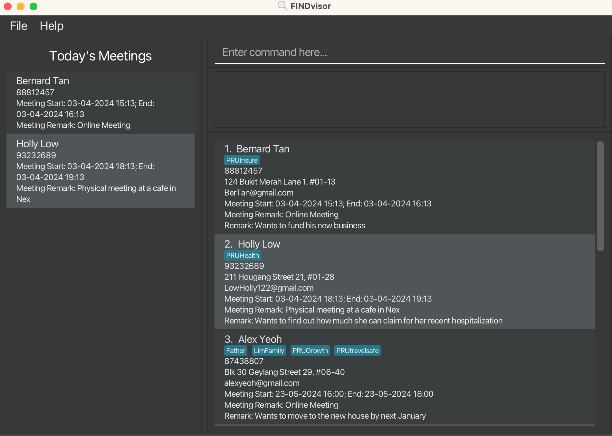

FINDvisor is a desktop app for **Singapore-based** financial advisors who are **comfortable using CLI applications**, and have to manage contacts with **Singapore-based mobile phone numbers**. If you **frequently schedule meetings and require quick access to your contacts' details**, then FINDvisor is the tool for you. It is optimized for typists, enabling individuals who type fast to perform contact management and meeting scheduling tasks efficiently.

FINDvisor enables financial advisors to **quickly save and retrieve their contacts' information** such as name, phone number, email and physical address. It also allows financial advisors to **add a remark and tags to specific contacts where needed**, while offering the capability to **manage their meeting details with their contacts**.

* If you are interested in using FINDvisor, head over to the [_Quick Start_ section of the **User Guide**](UserGuide.html#quick-start).
* If you are interested about developing FINDvisor, the [**Developer Guide**](DeveloperGuide.html) is a good place to start.

**Acknowledgements**
* This project is based on the AddressBook-Level3 project created by the [SE-EDU initiative](https://se-education.org).
* App icon and favicon: <a href="https://www.flaticon.com/free-icons/search" title="search icons">Search icons created by Maxim Basinski Premium - Flaticon</a>
* Libraries used: [JavaFX](https://openjfx.io/), [Jackson](https://github.com/FasterXML/jackson), [JUnit5](https://github.com/junit-team/junit5)
